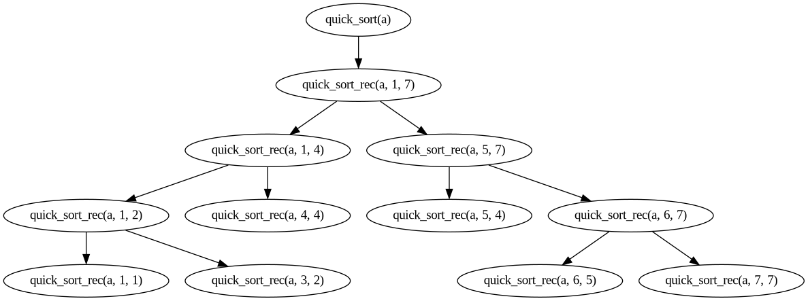

# Algoritmo de ordenación por rápida

```sh
proc quick_sort_rec (in/out a: array[1..n] of T, in lft,rgt: nat)
    var ppiv: nat
    if rgt > lft then 
    	partition(a,lft,rgt,ppiv)
        quick_sort_rec(a,lft,ppiv-1)
        quick_sort_rec(a,ppiv+1,rgt)
    fi
end proc
```

```sh
proc partition (in/out a: array[1..n] of T, in lft, rgt: nat, out ppiv: nat)
	var i,j: nat
	ppiv:= lft
	i:= lft+1
	j:= rgt
	while i ≤ j do 
		if  a[i] ≤ a[ppiv] then i:= i+1
		    a[j] ≥ a[ppiv] then j:= j-1
			a[i] > a[ppiv] & a[j] < a[ppiv] then  swap(a,i,j)
							      i:= i+1
							      j:= j-1
		fi
	od
	swap(a,ppiv,j)
	ppiv:= j
end proc
```

```sh
proc quick_sort (in/out a: array[1..n] of T)
    quick_sort_rec(a,1,n)
end proc
```

**Sea a := [7, 1, 10, 3, 4, 9, 5] el input**




quick_sort(a)
- quick_sort_rec(a, 1, 7)
	- if 7 > 1 
	- **-{ True }-**
		- [ ] partition(a, 1, 7, ppiv)
			- **-{ ppiv = 5 }-**
		- [ ] quick_sort_rec(a, 1, 4)
		- [ ] quick_sort_rec(a, 5, 7)
	- fi

#
- [ ] proc partition(a, 1, 7)
	- ppiv := 1
	- i := 2
	- j := 7
	- while i ≤ j 
	- [ ] do 
	- [ ] Δ<sub>2</sub>
		- if a[2] ≤ a[1]
			- **-{ True }-**
			- i := i + 1
			- **-{ i = 3 }-**
		- fi
	- [ ] Δ<sub>3</sub>
		- if a[3] ≤ a[1]
			- **-{ False }-**
		- else if a[7] ≥ a[1]
			- **-{ False }-**
		- else if a[3] > a[1] & a[7] < a[1]
			- **-{ True }-**
			- swap(a, 3, 7)
			- **-{ a = [7, 1, 5, 3, 4, 9, 10] }-**
			- i := i + 1 
			- **-{ i = 4 }-**
			- j := j - 1 
			- **-{ j = 6 }-**
		- fi
	- [ ] Δ<sub>4</sub> 
		- if a[4] ≤ a[1]
			- **-{ True }-**
			- i := i + 1 
			- **-{ i = 5 }-**
		- fi
	- [ ] Δ<sub>5</sub>
		- if a[5] ≤ a[1]
			- **-{ True }-**
			- i := i + 1 
			- **-{ i = 6 }-**
		- fi
	- [ ] Δ<sub>6</sub>
		- if a[6] ≤ a[1]
			- **-{ False }-**
		- else if a[6] ≥ a[1]
			- **-{ True }-**
			- j := j - 1 
			- **-{ j = 5 }-**
		- fi
	- [ ] od
	- swap(a, 1, 5)
	- **-{ a = [4, 1, 5, 3, 7, 9, 10] }-**
	- ppiv := j
	- **-{ ppiv = 5 }-**
- [ ] end proc

#

- [ ] proc quick_sort_rec(a, 1, 4)
	- if 4 > 1 
	- **-{ True }-**
		- [ ] partition(a, 1, 4, ppiv)
			- **-{ ppiv = 3 }-**
		- [ ] quick_sort_rec(a, 1, 2)
		- [ ] quick_sort_rec(a, 4, 4)
			- **-{ 4 > 4 ☰ False }-**
	- fi
- [ ] end proc 

#

- [ ] proc partition(a, 1, 4, ppiv)
	- ppiv := 1
	- i := 2
	- j := 4
	- while i ≤ j 
	- [ ] do 
	- [ ] Δ<sub>2</sub> 
		- if a[2] ≤ a[1]
			- **-{ True }-**
			- i := i + 1 
			- **{ i = 3 }-**
		- fi
	- [ ] Δ<sub>3</sub>
		- if a[3] ≤ a[1]
			- **-{ False }-**
		- else if a[4] ≥ a[1]
			- **-{ False }-**
		- else if a[3] > a[1] & a[4] < a[1]
			- **-{ True }-**
			swap(a, 3, 4)
			- **-{ a = [4, 1, 3, 5, 7, 9, 10] }-**
			- i := i + 1 
			- **-{ i = 4 }-**
			- j := j - 1 
			- **-{ j = 3 }-**
		- fi
	- [ ] od 
	- swap(a, 1, 3)
	- **-{ a = [3, 1, 4, 5, 7, 9, 10] }-**
	- ppiv := 3 
- [ ] end proc 

#

- [ ] quick_sort_rec(a, 1, 2)
	- if 1 > 2 
	- **-{ True }-**
		- [ ] partition(a, 1, 2, ppiv)
			- **-{ ppiv = 2 }-**
		- [ ] quick_sort_rec(a, 1, 1)
			- **-{ False ☰ 1 > 1 }-**
		- [ ] quick_sort_rec(a, 3, 2)
			- **-{ False ☰ 2 > 3 }-**
	- fi
- [ ] end proc

#

- [ ] partition(a, 1, 2, 2)
	- ppiv := 1
	- i := 2
	- j := 2
	- while i ≤ j 
	- [ ] do 
	- [ ] Δ<sub>2</sub> 
		- if a[2] ≤ a[1]
			- **-{ True }-**
			- i := i + 1
			- **-{ i = 3 }-**
		- fi
	- [ ] od
	- swap(a, 1, 2)
	- **-{ a = [1, 3, 4, 5, 7, 9, 10] }-**
	- ppiv := 2 
- [ ] end proc 

#

- [ ] quick_sort_rec(a, 5, 7)
	- if 7 > 5 
	- **-{ True }-**
		- [ ] partition(a, 5, 7, ppiv)
			- **-{ ppiv = 5 }-**
		- [ ] quick_sort_rec(a, 5, 4)
			- **-{ False ☰ 4 > 5 }-**
		- [ ] quick_sort_rec(a, 6, 7)
	- fi
- [ ] end proc

#

- [ ] partition(a, 5, 7, ppiv)
	- ppiv := 5
	- i := 6
	- j := 7
	- while i ≤ j 
	- [ ] do 
	- [ ] Δ<sub>6</sub> 
		- if a[6] ≤ a[5]
			- **-{ False }-**
		- else if a[7] ≥ a[5]
			- j := j - 1
			- **-{ j = 6 }-**
		- fi
	- [ ] Δ<sub>6</sub> 
		- if a[6] ≤ a[5]
			- **-{ False }-**
		- else if a[6] ≥ a[5]
			- j := j - 1
			- **-{ j = 5 }-**
		- fi
	- [ ] od 
	- swap(a, 5, 5)
	- **-{ a = [1, 3, 4, 5, 7, 9, 10] }-**
	- ppiv := 5
- [ ] end proc

#

- [ ] quick_sort_rec(a, 6, 7)
	- if 7 > 6 
	- **-{ True }-**
		- [ ] partition(a, 6, 7, ppiv)
			- **-{ ppiv = 6  }-**
		- [ ] quick_sort_rec(a, 6, 5)
			- **-{ False ☰  5 > 6 }-**
		- [ ] quick_sort_rec(a, 7, 7)
			- **-{ False ☰  7 > 7 }-**
	- fi
- [ ] end proc

#

- [ ] partition(a, 6, 7, ppiv)
	- ppiv := 6
	- i := 7
	- j := 7
	- while i ≤ j 
	- [ ] do 
	- [ ] Δ<sub>7</sub> 
		- if a[7] ≤ a[6]
			- **-{ False }-**
		- else if a[7] ≥ a[6]
			- j := j - 1
			- **-{ j = 6 }-**
		- fi
	- [ ] od 
	- swap(a, 6, 6)
	- **-{ a = [1, 3, 4, 5, 7, 9, 10] }-**
	- ppiv := 6
- [ ] end proc

## Output: a = [1, 3, 4, 5, 7, 9, 10]
